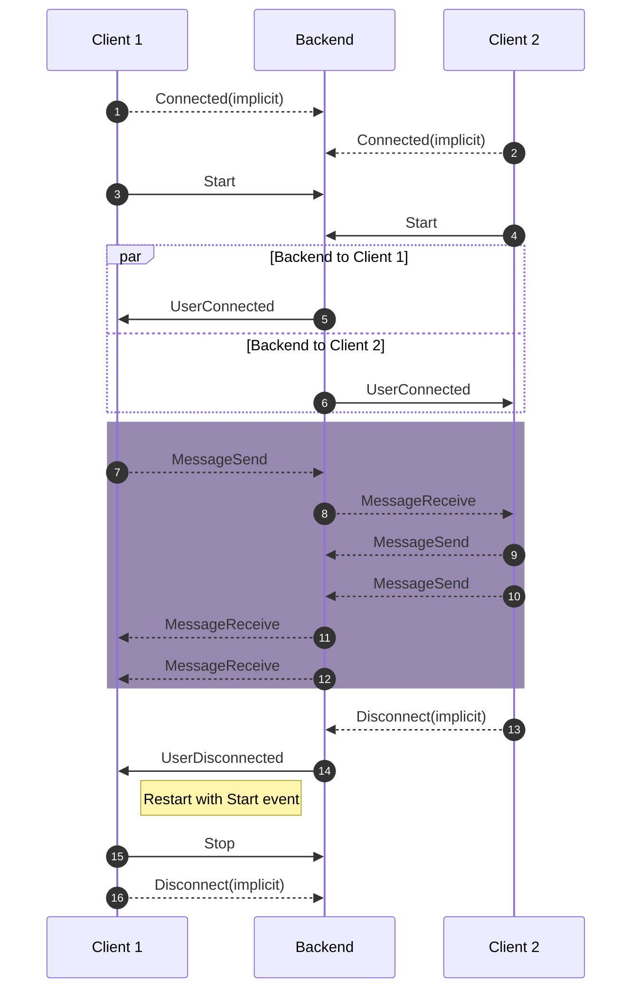
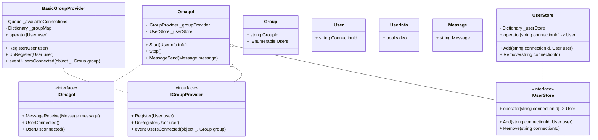

# Omagol

Any connection on omagol will be assigned a partner with whom they can converse anonymously with the other person.


Endpoint has events for when client is connected with other person or if the other party disconnects.
- `UserConnected` [Subscribe]
- `UserDisconnected` [Subscribe]

> NOTE: unless `UserConnected` event is sent any message sent will be ignored.

This endpoint has a chat event api, and video event api.
Within Chat event api, we have
- `MessageSend` [Invoke]
- `MessageReceive` [Subscribe]


> NOTE: `MessageReceive` is not triggered when message is sent by client.

## Structure of message object

```json
{
  "message": "<message-sent>"
}
```

## Design Decisions

A user connects to the endpoint using signalr connection. The user currently is only connected and can perform no action or will receive any events. For a client to start talking with hub they need to invoke `Start` event. Start event takes in a user info object currently with following structure.
```json
{
  "video": bool
}
```
The video field is there to signal hub whether user will be using video signalling feature as well or not.
Users with video field set to true will not be able to connect with users with video field set to false.

Once start event has been invoked, client will have to wait for `UserConnected` event to be returned by the hub. This signals that hub has found a suitable person for the user to connect to. Only once this event has been sent by the user can you send/receive message using `MessageSend` and `MessageReceive` event.

In case the person you are connected to disconnects, you are sent `UserDisconnected` event. From this point on the user cannot send/receive messages until they opt into initiating another connection by sending `Start` event again.

---

## Structure of objects

The following is the structure of strongly typed Omagol hub class as required by signalR. We have a group provider that is responsible for assigning group to the registered users.




