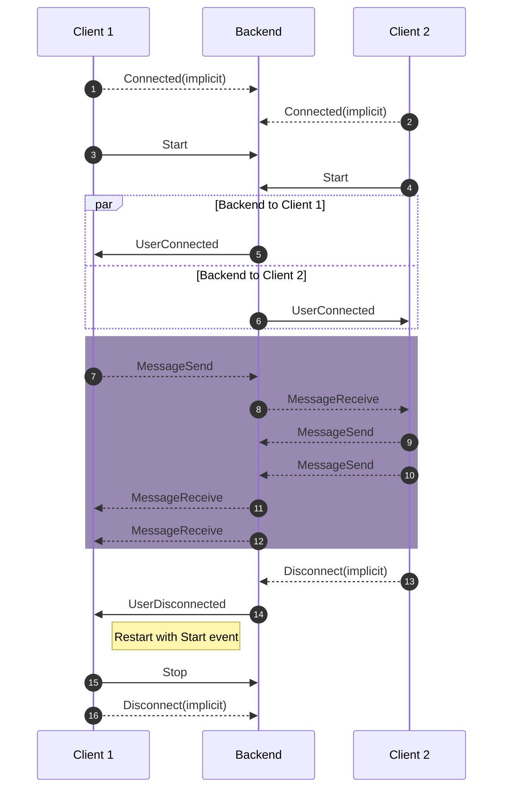
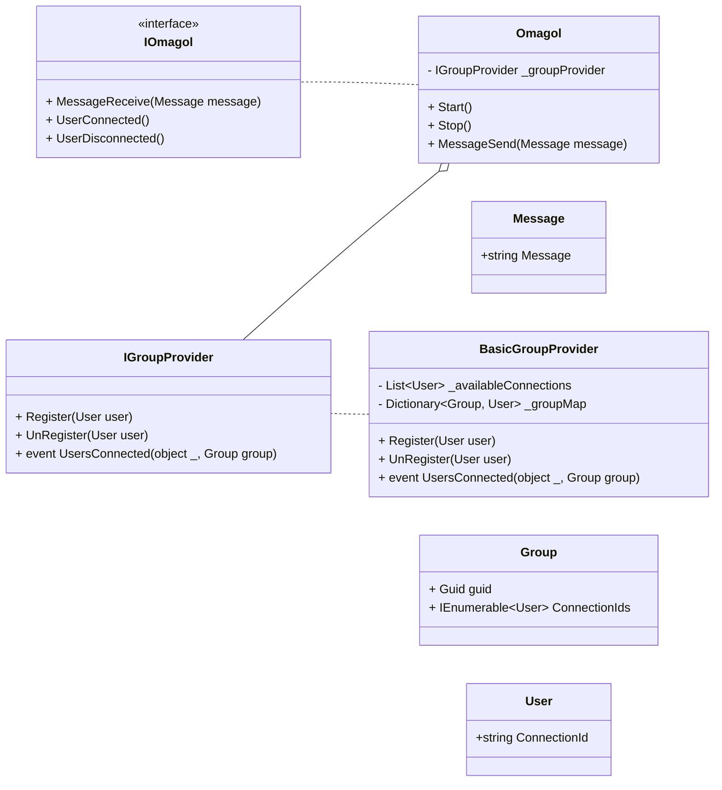

# Omagol

Any connection on omagol will be assigned a partner with whom they can converse anonymously with the other person.


Endpoint has events for when client is connected with other person or if the other party disconnects.
- `UserConnected` [Subscribe]
- `UserDisconnected` [Invoke]

> NOTE: unless `UserConnected` event is sent any message sent will be ignored.

This endpoint has a chat event api, and video event api.
Within Chat event api, we have 
- `MessageSend` [Invoke]
- `MessageReceive` [Subscribe]


> NOTE: `MessageReceive` is not triggered when message is sent by client.

## Structure of message object

```json
{
  "message": "<message-sent>"
}
```

---

## Structure of objects

The following is the structure of strongly typed Omagol hub class as required by signalR. We have a group provider that is responsible for assigning group to the registered users.




